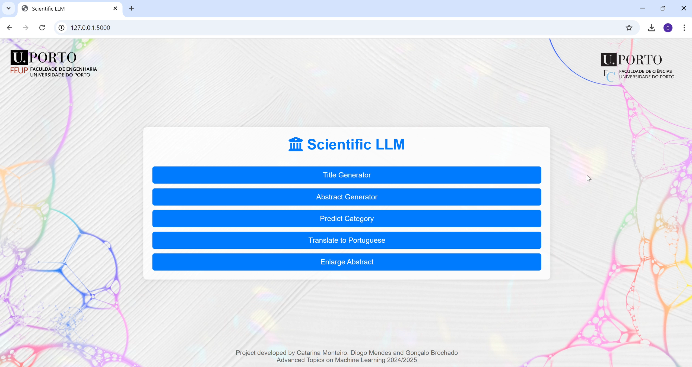

# Analysis-and-Generation-of-Scientific-Abstracts
First assignment of the course Advanced Topics in Machine Learning (MSc in Artificial Intelligence, 1st year, 1st semester)

## A little context
### Overview
This project focuses on analyzing scientific text data from the arXiv database and building tools for automated text generation and classification. Using a dataset from arxiv, it was aimed to generate titles from abstracts, generate abstracts from titles, classify papers into relevant research categories. The project includes evaluating model performance and exploring optimization strategies to enhance accuracy and efficiency in handling scientific abstracts. Other relevant features were added:the translation of abstracts or titles to portuguese and the enlargement of abstracts to an average size.

### Content
This repository contains two folders, a notebook and a readme file. On the Notebooks folder, there are five Jupyter notebooks, each designed to perform the specific tasks aforementioned. The interface folder contains two other (containing the elements of the interface and an index file) and a python file named `app.py`. Below are descriptions of each notebook and their respective functionalities.

### Files and Descriptions

#### On the Notebooks folder
1. `Enlarge_text.ipynb`
   
**Purpose:** Our objective is to calculate the average length of an abstract and augment any abstracts that fall below this average with additional, relevant content. This approach ensures a more standardized abstract length across the dataset, allowing each abstract to fully communicate the research objectives and context. By enhancing shorter abstracts, we aim to improve the consistency and informativeness of the dataset, facilitating better model performance and more accurate downstream analysis.

**Key Features:**

- **Input:** A string or text body that you wish to expand.
- **Processing:** Various text augmentation techniques, including synonym expansion and phrase rephrasing.
- **Output:** An enlarged version of the input text.

2. `Title_to_Abstract.ipynb`
   
**Purpose:** Our objective in this phase is to reverse the earlier process of generating titles from abstracts; instead, we aim to create detailed abstracts from provided titles. This approach will enable a quick and clear understanding of the research contributions associated with each title. To achieve this, we will employ two models: a baseline model and a specialized pre-trained model tailored for abstract generation. By comparing their performance, we will identify the most effective model for implementation, ensuring that the generated abstracts accurately reflect the essence of the research and enhance the accessibility of scientific findings.

**Key Features:**

- **Input:** A title.
- **Processing:** NLP methods to analyze the title and generate a relevant abstract.
- **Output:** A detailed abstract that describes the content implied by the title.

3. `Tradução.ipynb`
   
**Purpose:** This approach aims to translate the abstracts and titles of scientific papers to enhance accessibility for portuguese non-English speakers. By providing translations, we seek to break down language barriers and ensure that valuable research findings are available to a broader audience.

**Key Features:**

**Input:** Text in english.
**Processing:** Translation algorithms or API calls to translate the text.
**Output:** Translated text in portuguese.

4. `Abs_to_Title.ipynb`

   **Purpose:** Our objective with this approach is to generate precise and informative titles from paper abstracts, improving both paper identification and the accuracy of topic-specific searches. To achieve this, we will utilize two models: a baseline model and a specialized pre-trained model designed for title generation. By comparing their performance, we aim to identify the most effective model for implementation, optimizing both relevance and retrieval effectiveness for enhanced research accessibility.

   **Key Features:**

   - **Input:** An abstract.
   - **Processing:** NLP methods to analyze the abstract and generate a relevant title.
   - **Output:** A suitable title.
  
5. `Predict_categories.ipynb`

   **Purpose:** This notebook introduces a comprehensive categorization framework for abstracts, aimed at significantly streamlining the search process. To predict categories effectively, we will explore multiple approaches, including classification based on both the title and abstract, as well as an analysis using only the title. By comparing these strategies, we can identify the most effective method for accurate categorization, ultimately enhancing the discoverability and retrieval of relevant scientific papers in the dataset. This systematic approach will provide valuable insights into the relationship between titles, abstracts, and their associated categories, optimizing the search experience for users.

   **Key Features:**

   - **Input:** A title or abstract (we suggest you insert a title).
   - **Processing:** NLP methods to analyze the abstract or title and categorize them.
   - **Output:**  A set of categories in which the article fits.

#### On the interface folder

The main file `app.py` is stored in this folder.

##### On the static folder

The elements of the interface, such as logos, background and the css file are stored in here.

##### On the templates folder

An index html file is stored here.

### Usage

Run the file `app.py` on you cmd, there a hyperlink will appear in which you should make ctrl+Enter to access it. Then the interface will appear on your browser and you can you use as many times as you want!

